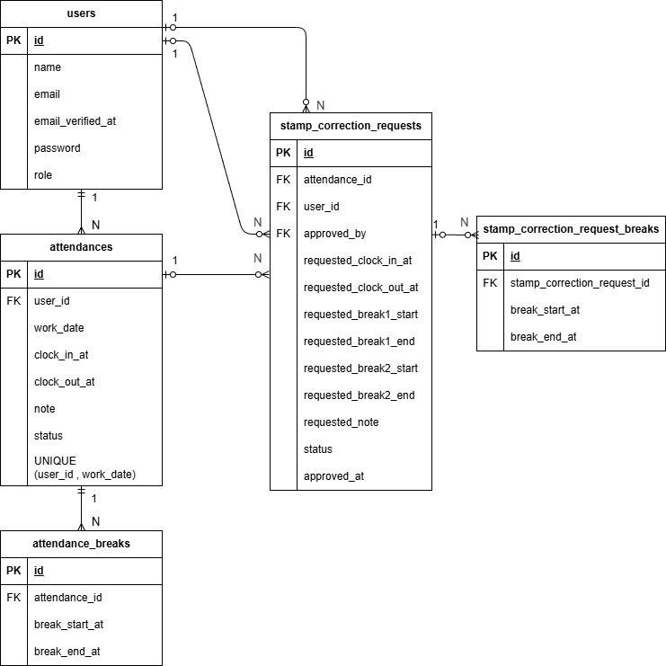

# COACHTECH 勤怠管理アプリ (模擬案件2)

一般ユーザーの勤怠打刻、勤怠修正申請、管理者による勤怠確認・修正申請承認を行う勤怠管理システムです。  
一般ユーザーは日々の出勤・休憩・退勤を記録でき、管理者は全体の勤怠状況確認やスタッフごとの月次勤怠管理、修正申請の承認を行うことができます。

## 環境構築

### Dockerビルド
```bash
git clone git@github.com:yukiya1620/attendance-management.git
cd attendance-management
docker compose up -d --build
```

### Laravel環境構築
```bash
docker compose exec app composer install
cp src/.env.example src/.env
docker compose exec app php artisan key:generate
docker compose exec app php artisan migrate --seed
```

### 動作確認URL
- 開発環境: `http://localhost`
- phpMyAdmin: `http://localhost:8080`
- MailHog: `http://localhost:8025`

## 使用技術（実行環境）

- PHP 8系
- Laravel 8.75
- Laravel Fortify 1.19
- Laravel Sanctum 2.11
- MySQL 8.0
- Nginx 1.25-alpine
- phpMyAdmin 5
- MailHog
- Docker / Docker Compose
- PHPUnit 9.5

## ER図



## 機能一覧

### 一般ユーザー機能
- 会員登録
- ログイン / ログアウト
- メール認証
- 認証メール再送
- 勤怠打刻
  - 出勤
  - 休憩入
  - 休憩戻
  - 退勤
- 現在日時表示
- 勤務ステータス表示
- 勤怠一覧確認（月次）
- 勤怠詳細確認
- 勤怠修正申請
- 自分の申請一覧確認
  - 承認待ち
  - 承認済み

### 管理者機能
- 管理者ログイン / ログアウト
- 日次勤怠一覧確認
- 日付切替表示
- 勤怠詳細確認 / 修正
- スタッフ一覧確認
- スタッフ別月次勤怠一覧確認
- 月切替表示
- CSV出力
- 修正申請一覧確認
  - 承認待ち
  - 承認済み
- 修正申請詳細確認
- 修正申請承認

## 画面一覧

### 一般ユーザー
- 会員登録画面
- ログイン画面
- 勤怠登録画面
- 勤怠一覧画面
- 勤怠詳細画面
- 申請一覧画面

### 管理者
- 管理者ログイン画面
- 勤怠一覧画面
- 勤怠詳細画面
- スタッフ一覧画面
- スタッフ別勤怠一覧画面
- 申請一覧画面
- 修正申請承認画面

## テーブル設計

### 主なテーブル
- `users`
- `attendances`
- `attendance_breaks`
- `stamp_correction_requests`
- `stamp_correction_request_breaks`

### テーブル概要

#### users
一般ユーザー・管理者のユーザー情報を管理するテーブルです。`role` カラムで権限を区別します。

#### attendances
日別の勤怠情報を管理するテーブルです。出勤・退勤・勤務状態を保持します。  
`user_id` と `work_date` に複合ユニーク制約があります。

#### attendance_breaks
勤怠に紐づく休憩開始時刻・終了時刻を管理するテーブルです。

#### stamp_correction_requests
勤怠修正申請を管理するテーブルです。修正後の出退勤時刻、休憩時刻、備考、承認状態を保持します。

#### stamp_correction_request_breaks
修正申請に紐づく休憩情報を管理するテーブルです。

### リレーション
- `users` : `attendances` = 1 : N
- `attendances` : `attendance_breaks` = 1 : N
- `attendances` : `stamp_correction_requests` = 1 : N
- `stamp_correction_requests` : `stamp_correction_request_breaks` = 1 : N
- `users` : `stamp_correction_requests` = 1 : N（申請者）
- `users` : `stamp_correction_requests` = 1 : N（承認者）

## バリデーション

### 会員登録
- 名前：必須、文字列、255文字以内
- メールアドレス：必須、メール形式、255文字以内、重複不可
- パスワード：必須
- 確認用パスワード：パスワードと一致

### ログイン
- メールアドレス：必須、メール形式
- パスワード：必須

### 勤怠修正申請
- 出勤時間：任意、時刻形式
- 退勤時間：任意、時刻形式、出勤時間より後
- 休憩開始時間：任意、時刻形式
- 休憩終了時間：任意、時刻形式、休憩開始時間より後かつ退勤時間以前
- 備考：必須
- 承認待ちデータが存在する場合は再申請不可

### 承認処理
- 対象データが存在すること
- 未承認データのみ承認可能

## 初期アカウント

### 管理者アカウント
- メールアドレス: `admin@example.com`
- パスワード: `password`

### 一般ユーザーアカウント
- `reina.n@coachtech.com`
- `taro.y@coachtech.com`
- `issei.m@coachtech.com`
- `keikichi.y@coachtech.com`
- `tomomi.a@coachtech.com`
- `norio.n@coachtech.com`

### 共通パスワード
`password`

## テスト

### 実行コマンド
```bash
docker compose exec app php artisan test
```

### 実行結果
- `65 passed`

### 主なテスト内容
- 一般ユーザー会員登録機能
- 一般ユーザーログイン機能
- 管理者ログイン機能
- メール認証機能
- 出勤 / 休憩入 / 休憩戻 / 退勤機能
- 勤怠一覧表示機能
- 勤怠詳細表示機能
- 勤怠修正申請機能
- 管理者による修正申請承認機能
- スタッフ一覧 / スタッフ別月次勤怠一覧機能

## 補足
- 一般ユーザーと管理者でログイン画面および利用可能機能を分けています。
- メール認証の確認には MailHog を使用しています。
- 勤怠修正申請時は備考入力が必須です。
- 承認待ちの修正申請が存在する場合、一般ユーザーは同じ勤怠に対して再度修正申請できません。
- 管理者はスタッフ別の月次勤怠確認およびCSV出力が可能です。